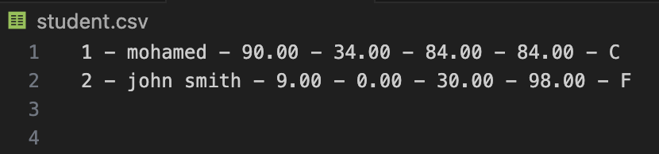
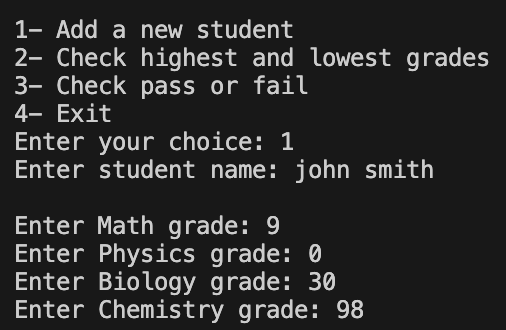
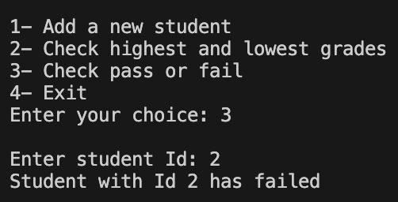

# 🚀 Projects

# 🏆 Student Grade Manager

A beginner-friendly **C** program to **add students**, **record grades**, **check highest & lowest marks**, and **determine pass/fail** status, using a simple text file (`student.csv`) to store all student records.


## 🧠 Features

- ✅ Add new students with their grades for Math, Physics, Biology, and Chemistry  
- 🔍 Check a student’s highest and lowest grades by ID  
- 🛡️ Validate inputs for student names and grades (grades between 0-100)  
- ✏️ Calculate letter grades based on average marks (A-F scale)  
- 🎯 Avoid invalid or duplicate IDs with ID validation  
- 📁 Store and read all records in a simple CSV text file


## 📸 Screenshots

### 📂 Student Data File (CSV)  


### ➕ Adding a New Student  


### 🔍 Searching Student Grades: Highest and Lowest


### ✅ Pass/Fail Check  



## 🚀 How to Run  

**▶️ Compile and run the program**:

```bash
gcc -o student_manager main.c
./student_manager
```
