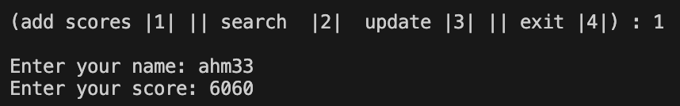
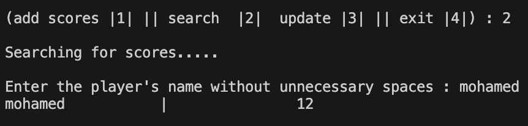
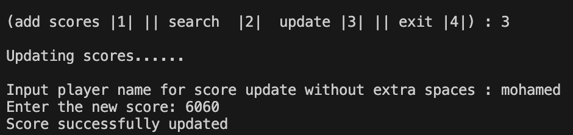

# 🏆 High Score Manager

A beginner-friendly Python program to **add**, **search**, and **update** player scores using a simple file-based system. All scores are stored in a `.txt` file and sorted automatically!

---

## 🧠 Features

- ✅ Add new players and their scores
- ❌ Prevents duplicate entries
- 🔍 Search for a player's score by name
- ✏️ Update existing scores easily
- 🔢 Automatically sorts scores (highest to lowest)
- 🛡️ Input validation for clean data

---
## 📸 Screenshots

### 📂 Adding a Score File (TXT)  


### ➕ Adding a Score  


### 🔍 Searching for a Player  


### ✏️ Updating a Score  

---

## 🚀 How to Run

1. Make sure Python 3 is installed  
2. Download or clone this repository  
3. Open a terminal in the project directory  
4. Run the script:

```bash
python high_score_manager.py
