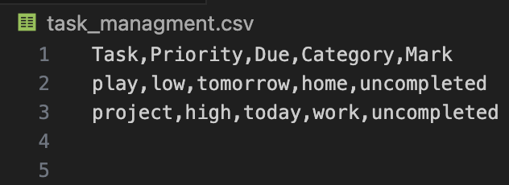
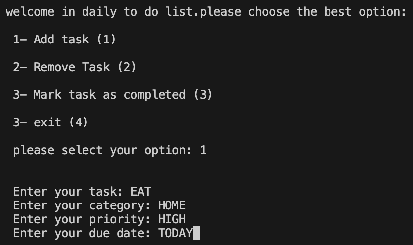
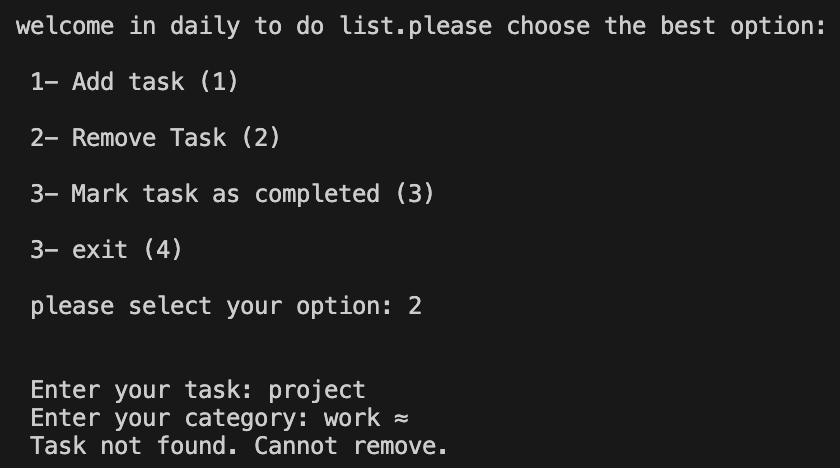
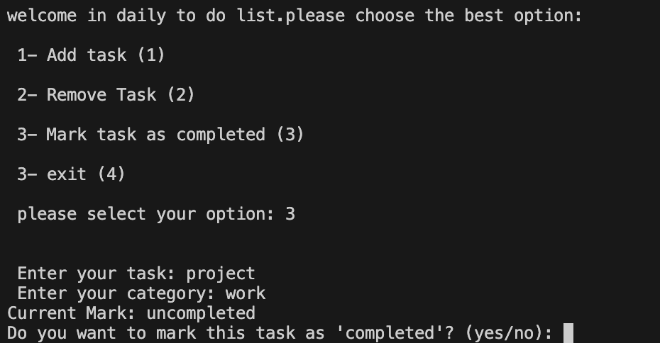

# ✅ To-Do List Manager 

A simple Python program to manage tasks from the command line. This tool allows users to add, view, complete, and delete to-do items using a csv file for storage.


## 🧠 Features

- 📝 Add new tasks easily
- 📋 View all tasks in a numbered list
- ✅ Mark tasks as completed
- ❌ Delete tasks by number
- 💾 Saves all tasks in a csv file
- 🔁 Persistent storage across sessions
- 🧱 Written using basic file handling and object-oriented principles


## 📚 Concepts Covered

- File handling (`open`, `read`, `write`)
- Object-Oriented Programming (classes and methods)
- Conditional statements and loops
- String and list manipulation
- User input handling and menu systems


## 📸 Screenshots

### 📂 A task File (csv)  


### ➕ Add task


### ❌ Remove task


### ✏️ Mark task



## 🚀 How to Run  

**▶️ Run the program**:

```bash
python3 main.py
```
